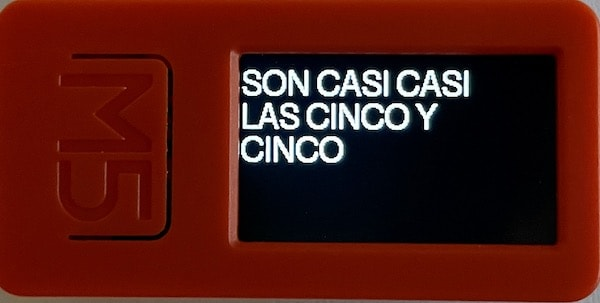

## A word clock using the M5StickC Plus ESP32 Platform

### Default language is Spanish


### Push the main button to toggle language between Spanish and English


Upon power-on, it uses WiFi to synchonize the time using NTP.

WiFi credentials are kept in the M5StickC Plus Preferences storage (EEPROM).

The sketch below is used to store the WiFi credential values ahead of time:

```
#include <M5StickCPlus.h>
#include <Preferences.h>

Preferences preferences;

const char* ssid = "YOUR_SSID";
const char* password = "YOUR_PASSWORD";

void setup() {
  Serial.begin(115200);
  Serial.println();

  preferences.begin("wordclockwifi", false);
  preferences.putString("ssid", ssid); 
  preferences.putString("password", password);

  Serial.println("WordClock Wifi Credentials Saved");

  preferences.end();
}

void loop() {

}
```

In the future I may replace the above by setting WiFi in AP mode and using a simple HTML form to get the credentials.
